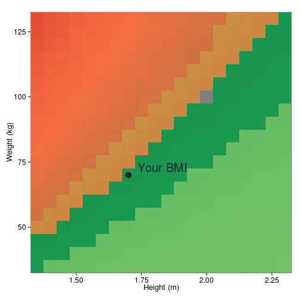

Body Mass index calculator
========================================================
author: AG
date: October 2015
**Generation of a BMI calculator using a Shiny app**
* [https://agcode.shinyapps.io/myapp] (https://agcode.shinyapps.io/myapp)
* [https://github.com/algom/devejh] (https://github.com/algom/devejh)

*Presentation done with R Studio R Presentations*

Body Mass Index (BMI)
========================================================

The body mass index **(BMI)** is a quantity value, based on the weight and hight of men and women.


- Quantifies tissue mass
- Categorizes individuals as 
 - **Underweight (<18.5)**
 - **Normal weight (18.5-25)**
 - **Overweight (25-30)**
 - **Obese (>30)**
 
###### [What use is the BMI? http://www.ncbi.nlm.nih.gov/pmc/articles/PMC2065990/] (http://www.ncbi.nlm.nih.gov/pmc/articles/PMC2065990/)

BMI calculation
========================================================

- It is calculated by dividing body mass *(kg)* divided by the square of the body height *(m)*

$BMI = weight/height^{2}$

- Expressed in SI units of **kg/m2**

- The app also calclulate sthe Resting Metabolic Rate (RMR) using the Mifflin - St Jeor equation, expressed in **kcal/day**

Male
$RMR = (9.99*weight) + (6.25*height) - (5*age) + 5$ 
Female
$RMR = (9.99*weight) + (6.25*height) - (5*age) - 161$ 


BMI calculation using the Shiny app
========================================================
- For eg. the individual inputs a weight of **70kg** and height of **1.70m**
- The app will recognize those as *input$weight* and *input$height*, calculates the BMI and classifies an individual in one of the **4** *BMI* categories, using *ifelse* statements, eg:

Your BMI is:

```
[1] 24.22145
```
With this value the **BMI** classifies as:

```
[1] "Normal weight"
```
It then usese this information to create a more graphical representation, using ggplot2

Shinying the BMI
========================================================
- The **Shiny** app then generates a category color coded BMI chart
- It shows the calculated **BMI**, localized at the appropiate category, showing how close/far this is from the optimum

 

Check it out at: [https://agcode.shinyapps.io/myapp] (https://agcode.shinyapps.io/myapp)
